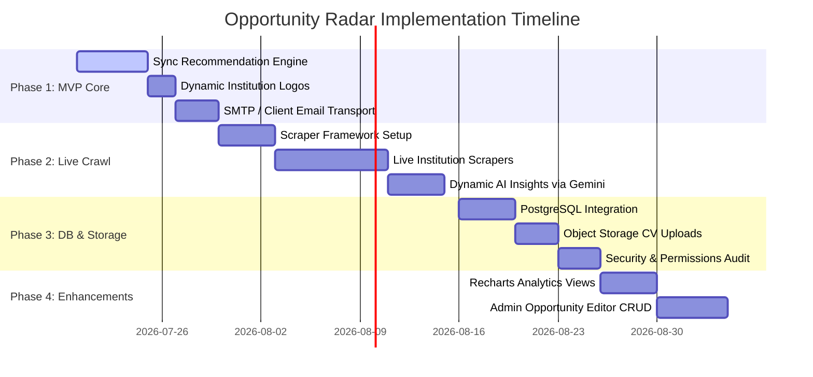

# Opportunity Radar — Platform Development Roadmap

This roadmap outlines the current status of all 28 core modules of the Opportunity Radar platform, categorizing them by implementation progress, and detailing a prioritized, phase-by-phase execution path to transition the repository from a feature-complete mockup to a production-scale system.

---

## Part 1: Module Classifications & Technical Audits

Every major module in the repository has been evaluated and categorized into one of four statuses:
- **Fully Implemented**: Complete, fully integrated with UI/UX, and functional in mock/dev setups.
- **Partially Implemented**: Works partially or in dev mode but contains architectural gaps for production scale.
- **Placeholder / Mock**: Uses hardcoded data, console logs, or mock templates; requires actual business logic implementation.
- **Missing**: Functionality or features are completely absent from both API and UI layers.

### 1. Authentication
*   **Status**: Fully Implemented
*   **What Already Works**: NextAuth.js v5 JWT session configurations, credentials-based signup/login with Zod schema validation, database integrations via Prisma, and middleware-protected routes.
*   **What is Incomplete**: None (for the core MVP scope).
*   **What Still Needs to be Built**: Verification token cleanup handlers.
*   **Estimated Complexity**: Low · **Priority**: High · **Dependencies**: Prisma, NextAuth.js

### 2. User Profile
*   **Status**: Fully Implemented
*   **What Already Works**: Profile UI forms mapping academic criteria (degree, year, CGPA scales, major), skill/language inputs, resume uploads, and completeness score analytics.
*   **What is Incomplete**: Raw error reporting on submission schema failures instead of precise front-end field validation.
*   **What Still Needs to be Built**: Client-side validation integration (`react-hook-form` + Zod schema).
*   **Estimated Complexity**: Low · **Priority**: High · **Dependencies**: Prisma ORM, Zod

### 3. Opportunity Database
*   **Status**: Fully Implemented
*   **What Already Works**: Comprehensive schema mappings for opportunity records (`Opportunity`) including location, type tags, funding details, levels, and indexed search variables. Contains 500+ seeded records.
*   **What is Incomplete**: None.
*   **What Still Needs to be Built**: Minor index optimizations for customized text queries.
*   **Estimated Complexity**: Medium · **Priority**: High · **Dependencies**: Prisma

### 4. Opportunity Detail Pages
*   **Status**: Fully Implemented
*   **What Already Works**: Details view (`/opportunities/[slug]`) rendering funding types, country listings, academic requirements, and recommendation match explanation tags.
*   **What is Incomplete**: Avatar image layouts ignore custom logo paths from the database.
*   **What Still Needs to be Built**: Dynamic image loaders for official institution logos.
*   **Estimated Complexity**: Low-Medium · **Priority**: High · **Dependencies**: Opportunity Database, Recommendation Engine

### 5. Dashboard
*   **Status**: Fully Implemented
*   **What Already Works**: Welcome greeting layouts, profile strength bars, AI Insights bullet board, dashboard metrics tabs, and opportunity grid lists.
*   **What is Incomplete**: Data visualization elements (graphs showing application status progress).
*   **What Still Needs to be Built**: Interactive metrics charts.
*   **Estimated Complexity**: Medium · **Priority**: High · **Dependencies**: Recommendation Engine, Notifications

### 6. Recommendation Engine
*   **Status**: Fully Implemented
*   **What Already Works**: Weighted factor calculator (`src/lib/engines/recommendation.ts`) checking profile matches, skills parameters, research domains, prestige scores, and deadline urgency.
*   **What is Incomplete**: Evaluation is executed on-the-fly in API endpoints; the defined DB cache table (`RecommendationScore`) is unused.
*   **What Still Needs to be Built**: Sync routines to pre-compute and store recommendation scores in database columns on profile save or crawler runs.
*   **Estimated Complexity**: High · **Priority**: High · **Dependencies**: Profile data, Eligibility Engine

### 7. Eligibility Engine
*   **Status**: Fully Implemented
*   **What Already Works**: Rule calculations checking academic thresholds, converting multi-grade CGPAs (e.g. converting a user's 4.0 or 10.0 scale to 10-point scale limits), and fuzzy major/branch matching.
*   **What is Incomplete**: Major branch fuzzy matching uses hardcoded alias arrays in code.
*   **What Still Needs to be Built**: Synonym matching settings table in database or dictionary mappings.
*   **Estimated Complexity**: Medium · **Priority**: High · **Dependencies**: Profile data, Zod schema

### 8. Search
*   **Status**: Fully Implemented
*   **What Already Works**: Debounced instant key search against titles, institutions, location listings, and research divisions.
*   **What is Incomplete**: The schema's `SearchHistory` table is unpopulated and unused.
*   **What Still Needs to be Built**: API integration to store query logs and display user's recent queries.
*   **Estimated Complexity**: Low-Medium · **Priority**: Medium · **Dependencies**: Database text index

### 9. Filtering
*   **Status**: Fully Implemented
*   **What Already Works**: Query parameters for Type, Country, Funding, Deadline (week, month, quarter), Mode (Onsite, Remote, Hybrid), and Verified filter parameters.
*   **What is Incomplete**: Layout shifting on the filters dropdown popup.
*   **What Still Needs to be Built**: Minor CSS transition refactoring to ensure static sizing.
*   **Estimated Complexity**: Low · **Priority**: High · **Dependencies**: Search API

### 10. Institution Pages
*   **Status**: Fully Implemented
*   **What Already Works**: Browsable list index (`/institutions`) and detailed page view (`/institutions/[slug]`) listing active and past opportunities, overview, prestige, and country details.
*   **What is Incomplete**: Institution logo display (falls back to initials rendering).
*   **What Still Needs to be Built**: Logo image loader inside avatar components.
*   **Estimated Complexity**: Low-Medium · **Priority**: High · **Dependencies**: Opportunity Database

### 11. Bookmarks
*   **Status**: Fully Implemented
*   **What Already Works**: Database relations, bookmarks toggle endpoints (POST/DELETE), and instant visual feedback on UI.
*   **What is Incomplete**: None.
*   **What Still Needs to be Built**: None.
*   **Estimated Complexity**: Low · **Priority**: High · **Dependencies**: Authentication

### 12. Applications
*   **Status**: Fully Implemented
*   **What Already Works**: Tracked applications board on `/applied`, allowing updating status (APPLIED, IN_PROGRESS, ACCEPTED, etc.) and attaching notes.
*   **What is Incomplete**: Rich notes validation interface.
*   **What Still Needs to be Built**: Dynamic application timeline visualization.
*   **Estimated Complexity**: Medium · **Priority**: High · **Dependencies**: Opportunity Database

### 13. Notifications
*   **Status**: Partially Implemented
*   **What Already Works**: UI notifications layout page, read/unread indicators, and mark-as-read API routes.
*   **What is Incomplete**: Notification crons are not scheduled, and notification cards do not update in real-time.
*   **What Still Needs to be Built**: In-app websocket connection or clean page polling context to update alerts count.
*   **Estimated Complexity**: Medium · **Priority**: Medium · **Dependencies**: Database, Cron system

### 14. Crawler System
*   **Status**: Placeholder / Mock
*   **What Already Works**: Job execution model logic, database tables (`CrawlerJob`, `CrawlerLog`), and log auditing loops.
*   **What is Incomplete**: Scraper engine spawns mock opportunities based on static templates instead of fetching live site pages.
*   **What Still Needs to be Built**: Live crawler handlers to query and parse direct raw target sites.
*   **Estimated Complexity**: High · **Priority**: High · **Dependencies**: Database, Cheerio/Playwright

### 15. Opportunity Extraction
*   **Status**: Placeholder / Mock
*   **What Already Works**: System creates mock opportunities details.
*   **What is Incomplete**: Scraping targets, parsers, and external network fetch code are completely missing.
*   **What Still Needs to be Built**: Parsers for HTML tables, PDF application brochures, or raw RSS feeds.
*   **Estimated Complexity**: High · **Priority**: High · **Dependencies**: Crawler System

### 16. Opportunity Normalization
*   **Status**: Partially Implemented
*   **What Already Works**: Normalizes deadline dates, modes, and funding strings during mock crawl cycles.
*   **What is Incomplete**: Processing of free-text academic requirements (e.g. turning "CGPA > 8.5/10" in a description paragraph into a numeric `minCgpa` DB value).
*   **What Still Needs to be Built**: Regex parsing engines or AI extraction parsers (Gemini/OpenAI) to extract structured fields from unstructured descriptions.
*   **Estimated Complexity**: Medium-High · **Priority**: Medium · **Dependencies**: Zod Schemas

### 17. Duplicate Detection
*   **Status**: Partially Implemented
*   **What Already Works**: Unique hash checks (`sourceHash`) using opportunity titles, institutions, and slugs to prevent identical records from repeating.
*   **What is Incomplete**: Fuzzy duplication detection (identifying same listing with a minor typo or different title format).
*   **What Still Needs to be Built**: Similarity check algorithms (e.g., Levenshtein Distance or duplicate url redirects resolution).
*   **Estimated Complexity**: Medium · **Priority**: Low-Medium · **Dependencies**: database hashing

### 18. Opportunity Ranking
*   **Status**: Fully Implemented
*   **What Already Works**: Sorting options (Best Match, Deadline, Popular, Newest) mapped on feeds.
*   **What is Incomplete**: Ranking weights are static across all users' accounts.
*   **What Still Needs to be Built**: Weight personalization slider on user dashboard profiles (e.g. select prestige over funding).
*   **Estimated Complexity**: Low-Medium · **Priority**: Low · **Dependencies**: Recommendation Engine

### 19. AI Insights
*   **Status**: Placeholder / Mock
*   **What Already Works**: Insights bullet rendering container on dashboard.
*   **What is Incomplete**: Bullet lists are static mock text statements.
*   **What Still Needs to be Built**: Dynamic profile comparison prompt analyzer running via AI API to generate customized recommendations notifications.
*   **Estimated Complexity**: Medium · **Priority**: Medium · **Dependencies**: Profile data, Gemini API

### 20. Admin Dashboard
*   **Status**: Partially Implemented
*   **What Already Works**: Crawler status summaries, job log outputs, manual "Run Crawler" trigger button, and recent users count.
*   **What is Incomplete**: The ability to create, delete, or verify opportunity items manually in UI forms.
*   **What Still Needs to be Built**: CRUD management forms for opportunities and templates on the admin dashboard.
*   **Estimated Complexity**: Medium · **Priority**: Medium-High · **Dependencies**: Admin role checks

### 21. Analytics
*   **Status**: Missing
*   **What Already Works**: None.
*   **What is Incomplete**: Dashboard metrics visualization.
*   **What Still Needs to be Built**: Database query aggregators to compile charts showing user target success trends.
*   **Estimated Complexity**: Medium · **Priority**: Low-Medium · **Dependencies**: Recharts

### 22. Resume Upload
*   **Status**: Partially Implemented
*   **What Already Works**: PDF and DOC verification headers, and server-side write to `public/uploads` directory.
*   **What is Incomplete**: Disk space writes are ephemeral; container resets in serverless hosting wipe files.
*   **What Still Needs to be Built**: AWS S3 or Google Cloud Storage client integration.
*   **Estimated Complexity**: Low-Medium · **Priority**: High · **Dependencies**: AWS SDK / R2 credentials

### 23. Email System
*   **Status**: Placeholder / Mock
*   **What Already Works**: HTML mail templates for matching, verifications, resets, and deadline warnings.
*   **What is Incomplete**: Mail engine only console.logs details instead of invoking transport client connection.
*   **What Still Needs to be Built**: Integration with SMTP, Resend, or SendGrid API using nodemailer.
*   **Estimated Complexity**: Low · **Priority**: High · **Dependencies**: Nodemailer / Resend SDK

### 24. API Layer
*   **Status**: Fully Implemented
*   **What Already Works**: REST endpoints supporting status validation, clean error catching structures, and Zod parsers.
*   **What is Incomplete**: None.
*   **What Still Needs to be Built**: API listing pagination details.
*   **Estimated Complexity**: Low · **Priority**: High · **Dependencies**: Next.js route handlers

### 25. Database
*   **Status**: Partially Implemented
*   **What Already Works**: Main Prisma models and SQLite connections setup.
*   **What is Incomplete**: SQLite's write locking locks concurrent operations under scale.
*   **What Still Needs to be Built**: Prisma target migration to host on a production relational database (e.g. Postgres).
*   **Estimated Complexity**: Medium · **Priority**: High · **Dependencies**: Database target configurations

### 26. Security
*   **Status**: Partially Implemented
*   **What Already Works**: NextAuth middleware authentication, database-level rate limiting, and password hashing schema checks.
*   **What is Incomplete**: Upload integrity verification (testing for executable structures inside PDFs). Object-level permissions logic in write endpoints.
*   **What Still Needs to be Built**: Security headers configuration, upload scanning, explicit ownership checks on PATCH/PUT endpoints.
*   **Estimated Complexity**: Medium · **Priority**: High · **Dependencies**: Next.js middleware configs

### 27. Performance
*   **Status**: Partially Implemented
*   **What Already Works**: Index lookup tables.
*   **What is Incomplete**: Dynamic execution of recommendations inside heavy list loads slowing endpoints.
*   **What Still Needs to be Built**: Score calculation offloader, Redis query caching systems.
*   **Estimated Complexity**: Medium-High · **Priority**: Medium · **Dependencies**: Redis cache drivers

### 28. Deployment Readiness
*   **Status**: Partially Implemented
*   **What Already Works**: Build pipelines validating TypeScript compiles and code formatting rules.
*   **What is Incomplete**: Ephemeral server storage limits and local database bindings block production launches.
*   **What Still Needs to be Built**: Docker configuration files, multi-stage env overrides.
*   **Estimated Complexity**: Medium · **Priority**: High · **Dependencies**: Build profiles

---

## Part 2: Module Status Summary Table

| Module | Status | Complexity | Priority | Primary Dependency |
|---|---|---|---|---|
| **1. Authentication** | Fully Implemented | Low | High | NextAuth.js, Prisma |
| **2. User Profile** | Fully Implemented | Low | High | Prisma ORM, Zod |
| **3. Opportunity Database** | Fully Implemented | Medium | High | Prisma |
| **4. Opportunity Detail Pages** | Fully Implemented | Low-Medium | High | Opportunity DB |
| **5. Dashboard** | Fully Implemented | Medium | High | Recommendation Engine |
| **6. Recommendation Engine** | Fully Implemented | High | High | Profile, Eligibility Engine |
| **7. Eligibility Engine** | Fully Implemented | Medium | High | Profile data, Zod |
| **8. Search** | Fully Implemented | Low-Medium | Medium | Database index |
| **9. Filtering** | Fully Implemented | Low | High | Search API |
| **10. Institution Pages** | Fully Implemented | Low-Medium | High | Opportunity DB |
| **11. Bookmarks** | Fully Implemented | Low | High | Authentication |
| **12. Applications** | Fully Implemented | Medium | High | Opportunity DB |
| **13. Notifications** | Partially Implemented | Medium | Medium | DB, Email, WebSockets |
| **14. Crawler System** | Placeholder / Mock | High | High | Prisma, Scraper drivers |
| **15. Opportunity Extraction** | Placeholder / Mock | High | High | Crawler System |
| **16. Opportunity Normalization** | Partially Implemented | Medium-High | Medium | Zod Schemas |
| **17. Duplicate Detection** | Partially Implemented | Medium | Low-Medium | Database hashing |
| **18. Opportunity Ranking** | Fully Implemented | Low-Medium | Low | Recommendation Engine |
| **19. AI Insights** | Placeholder / Mock | Medium | Medium | Profile, Gemini API |
| **20. Admin Dashboard** | Partially Implemented | Medium | Medium-High | Admin permissions checks |
| **21. Analytics** | Missing | Medium | Low-Medium | Recharts, DB queries |
| **22. Resume Upload** | Partially Implemented | Low-Medium | High | AWS S3 SDK |
| **23. Email System** | Placeholder / Mock | Low | High | Nodemailer / Resend |
| **24. API Layer** | Fully Implemented | Low | High | Next.js routes |
| **25. Database** | Partially Implemented | Medium | High | Postgres configs |
| **26. Security** | Partially Implemented | Medium | High | Middleware configs |
| **27. Performance** | Partially Implemented | Medium-High | Medium | Key-value store / Redis |
| **28. Deployment Readiness**| Partially Implemented | Medium | High | Deployment profiles |

---

## Part 3: Implementation Phases Roadmap

This sequence transitions Opportunity Radar from a mockup into a complete, robust production system.

### Phase 1 – Critical MVP (Product Core Completion)
Focus area: *Moving crucial stubs to functional code without touching infrastructure configurations.*

1.  **Calculate & Cache Recommendation Scores (`RecommendationScore` Sync)**
    *   *Action*: Offload on-the-fly calculations. Wire hooks/triggers in Profile PUT API and Crawler run loop to compute recommendation and eligibility results, storing them directly in `RecommendationScore` and `EligibilityRecord` database tables. Query these precomputed outputs in Explore feeds to optimize loading times.
2.  **Fix Institution Logo Avatar Rendering**
    *   *Action*: Adjust the frontend `InstitutionAvatar` component to load the `logoUrl` field correctly when available. Write database seed update migrations to assign appropriate mock logo URLs to institutions.
3.  **Wired Email Transport Setup (SMTP / Resend integration)**
    *   *Action*: Switch `src/lib/email.ts` to utilize standard SMTP credentials or Resend Client API, allowing email verifications, passwords resets links, and match notifications to deliver to target mailboxes.

### Phase 2 – Live Crawl & Product Completeness
Focus area: *Replacing mock templates with actual web scrapers and dynamic AI features.*

1.  **Configure Scraper Collector Engine**
    *   *Action*: Integrate `cheerio` or clean network fetching protocols in `src/lib/crawler` to pull raw web page data from a list of primary target institutions.
2.  **Design Live Target Parsers**
    *   *Action*: Write parsing blocks to process announcements directories (e.g. targeting research opportunities tables on target university sites).
3.  **Replace Mock Insights with Dynamic LLM Integrations**
    *   *Action*: Connect Gemini API endpoints to scan target users' profile skills/interests and return personalized weekly checklist insights.
4.  **Populate User Search History UI**
    *   *Action*: Update the Search listing page to write log metrics to `SearchHistory` and read them to build a "Recent Searches" panel.

### Phase 3 – Production Infrastructure & Readiness
Focus area: *Preparing the codebase for stateless cloud environments.*

1.  **Configure PostgreSQL Migration**
    *   *Action*: Change datasource settings from SQLite to PostgreSQL. Update Prisma schemas, recreate migrations files, and verify foreign constraints execution.
2.  **Switch to Object Storage (S3 / R2 Bucket)**
    *   *Action*: Switch local disk file writer operations in `/api/upload` to upload assets directly to an AWS S3 or Cloudflare R2 bucket.
3.  **Endpoint Ownership Authorization Verification**
    *   *Action*: Perform security refactoring of API endpoints to verify user session context ownership before executing mutate commands.

### Phase 4 – Future Platform Enhancements
Focus area: *Adding administrative widgets, analytics tools, and performance tweaks.*

1.  **Admin CRUD Controls**
    *   *Action*: Add full edit/creation and delete controls on the admin dashboard page.
2.  **Interactive Performance Charts**
    *   *Action*: Render graphics showing stats/distributions for trending opportunity fields and user bookmarks progress using Recharts.
3.  **Redis Caching Engine**
    *   *Action*: Implement memory cache storage (such as Redis) to store frequently queried search listings.
